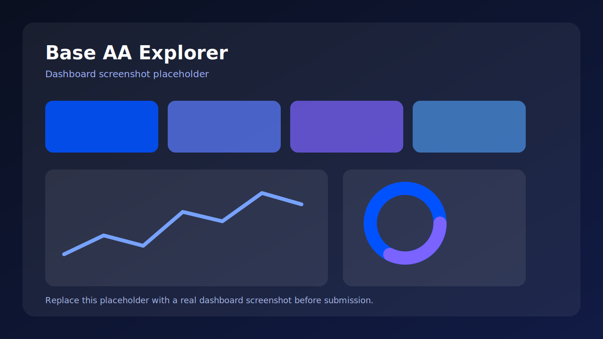

# 🔍 Base AA Explorer

[](#license)
[](#development)
[](#development)
[](#why-this-matters)
[](#why-this-matters)

**The first dedicated ERC-4337 analytics dashboard for Base — built to give real-time visibility into UserOperations, Paymasters, and Smart Account adoption.**

> **Status:** This repository currently contains the grant MVP spec, roadmap, bootstrap guide, and agent harness for the implementation. The target product and architecture below are the canonical direction defined in the project SSOT.



## Why This Matters

Base is pushing **Account Abstraction** as a core onboarding strategy, but the ecosystem still lacks a dedicated analytics surface for the metrics that matter most: **UserOperations volume, Paymaster sponsorship, and Smart Account adoption**. That means builders, grant reviewers, and ecosystem teams cannot easily measure whether AA usage is actually growing.

**Base AA Explorer** solves that gap with a focused, read-only analytics stack for **Base mainnet** and **EntryPoint v0.7**. It is designed to surface actionable AA adoption data fast, with a lightweight MVP architecture that can be shipped in one sprint and expanded post-grant.

## Features

- ⚡ **Real-time UserOperation ingestion** from Base EntryPoint v0.7 via WSS
- 🧩 **ERC-4337 decoding pipeline** for `handleOps`-based UserOp records
- 💸 **Paymaster distribution analytics** for sponsored transaction visibility
- 👛 **Smart Account classification** for wallet adoption breakdowns
- 📈 **Daily and weekly trend views** for AA ecosystem growth tracking
- 🧪 **Read-only FastAPI surface** with explicit API contracts for dashboard consumption
- 🖥️ **Next.js 14 dashboard** optimized for fast first-load performance
- 🛟 **Resilience path** with reconnect logic and HTTP polling fallback when WSS degrades

## Architecture

```text
Base EntryPoint v0.7 (WSS)
    │
    ▼
Indexer (WSS subscription + HTTP fallback)
    │
    ▼
Decoder (ERC-4337 UserOp parsing)
    │
    ▼
Classifier (Paymaster + Smart Account identification)
    │
    ▼
SQLite Storage + Daily Stats Aggregator
    │
    ▼
FastAPI REST API
    │
    ▼
Next.js 14 Dashboard
```

### Core pipeline

1. Subscribe to **Base EntryPoint v0.7** events over WebSocket
2. Decode UserOperations into structured records
3. Classify known **Paymasters** and **Smart Account** implementations
4. Aggregate usage stats into query-friendly summaries
5. Serve data through a read-only API
6. Visualize adoption on a Base-focused dashboard

## Quick Start

This repository is currently **spec-first**. The canonical local bootstrap lives in [`BOOTSTRAP.md`](BOOTSTRAP.md).

```bash
# 1) Review the bootstrap guide
sed -n '1,220p' BOOTSTRAP.md

# 2) After scaffolding the backend, run backend verification
cd backend && poetry env use python3.11 && poetry install --with dev && poetry run pytest -q && poetry run ruff check .

# 3) After scaffolding the frontend, run frontend verification
cd ../frontend && npm run build && npm test
```

### Prerequisites

- Node.js **18+**
- Python **3.11+**
- Git
- Poetry **2.2+** for backend dependency management

### Environment variables

Use a local `.env` file and never commit secrets.

```bash
BASE_RPC_WSS=wss://base-mainnet.g.alchemy.com/v2/YOUR_KEY
BASE_RPC_HTTPS=https://base-mainnet.g.alchemy.com/v2/YOUR_KEY
NEXT_PUBLIC_API_URL=http://localhost:8000
```

## API Reference

| Endpoint | Method | Description | Response shape |
|---|---|---|---|
| `/api/userops?page=N` | `GET` | Paginated UserOperation feed | `{ items, total, page }` |
| `/api/userops/{hash}` | `GET` | Single UserOperation detail | `UserOp` |
| `/api/stats` | `GET` | Daily and weekly aggregate stats | `{ daily, total_ops, active_wallets }` |
| `/api/paymasters` | `GET` | Paymaster distribution data | `{ items, total_sponsored }` |
| `/api/smart-accounts` | `GET` | Smart Account type breakdown | `{ items, total_accounts }` |
| `/health` | `GET` | Service health check | `{ status, chain, entrypoint }` |

## Dashboard Pages

### `/`
Overview page with the top-line KPIs:
- total UserOperations
- active wallets
- sponsored transaction share
- daily trend data

### `/userops`
Real-time feed for recent UserOperations with pagination and inspection of individual records.

### `/paymasters`
Paymaster distribution view for understanding sponsorship concentration and ecosystem usage.

### `/smart-accounts`
Smart Account adoption breakdown by implementation type.

## Configuration

### Target chain and protocol scope

- **Chain:** Base mainnet only
- **EntryPoint:** v0.7 only
- **Mode:** Read-only analytics

### Known contracts tracked in the MVP

| Contract | Address |
|---|---|
| EntryPoint v0.7 | `0x0000000071727De22E5E9d8BAf0edAc6f37da032` |
| Coinbase Paymaster | `0x2FAEB0760D4230Ef2aC21496Bb4F0b47D634FD4c` |
| Pimlico Paymaster | `0x3fC91A3afd70395Cd496C647d5a6CC9D4B2b7FAD` |
| Coinbase Smart Wallet Factory | `0x0BA5ED0c6AA8c49038F819E587E2633c4A9F428a` |
| Safe Factory | `0x5de4839a76cf55d0c90e2061ef4386d962E15ae3` |

### Reliability rules

- WebSocket reconnect with exponential backoff
- HTTP polling fallback after repeated WSS failure
- Kill condition if Base EntryPoint ABI access is unavailable or WSS/polling both fail persistently

## Performance Targets

The MVP is designed around two primary SLOs:

- **Data freshness:** UserOperations reflected in storage within **5 minutes**
- **Dashboard LCP:** Page load under **2 seconds**

Operationally, the project also targets:

- **API response time:** under **1 second** for core analytics endpoints

## Development

### Build

```bash
cd backend && poetry install --with dev && cd ../frontend && npm run build
```

### Test

```bash
cd backend && poetry run pytest && cd ../frontend && npm test
```

### Lint

```bash
cd backend && poetry run ruff check . && cd ../frontend && npx eslint .
```

### Planned MVP structure

```text
backend/
  app/
    routers/
    services/
    models/
  tests/
frontend/
  src/
    app/
    components/
    hooks/
    lib/
    __tests__/
docs/
  bets/
```

## Deployment

### Frontend

- **Target:** Vercel
- **Reason:** fast deployment path for a grant MVP, strong fit for Next.js 14

### Backend

- **Target:** any small VPS or container host
- **Options:** Docker or `systemd`-managed FastAPI process

### Database

- **MVP:** SQLite / `aiosqlite`
- **Post-grant:** migrate to PostgreSQL + TimescaleDB for historical scale and richer analytics

## Roadmap

### v0.1 — Grant MVP
- Base-only analytics
- EntryPoint v0.7 indexing
- FastAPI endpoints
- Next.js dashboard
- Vercel deployment

### v0.2 — Production data layer
- TimescaleDB migration
- stronger historical storage
- improved aggregation and query performance

### v0.3 — Expanded ecosystem analytics
- richer trend analysis
- deeper contract registry coverage
- selective expansion beyond the initial MVP boundaries

## Contributing

Contributions are welcome, especially around:

- ERC-4337 decoding correctness
- Base-specific contract classification
- dashboard UX and charting clarity
- API and storage performance
- test coverage for indexing and fallback logic

If you open a PR, please keep changes small, explicit, and easy to verify.

## Acknowledgments

- [Base Docs](https://docs.base.org)
- [ERC-4337 Specification](https://eips.ethereum.org/EIPS/eip-4337)
- [Alchemy Docs](https://www.alchemy.com/docs)
- The ERC-4337 authors and smart account ecosystem contributors

## License

MIT
